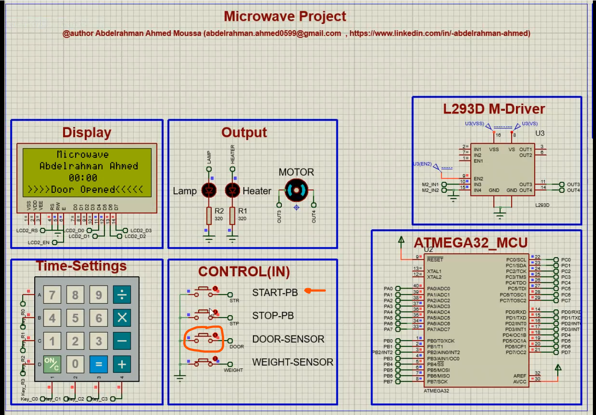
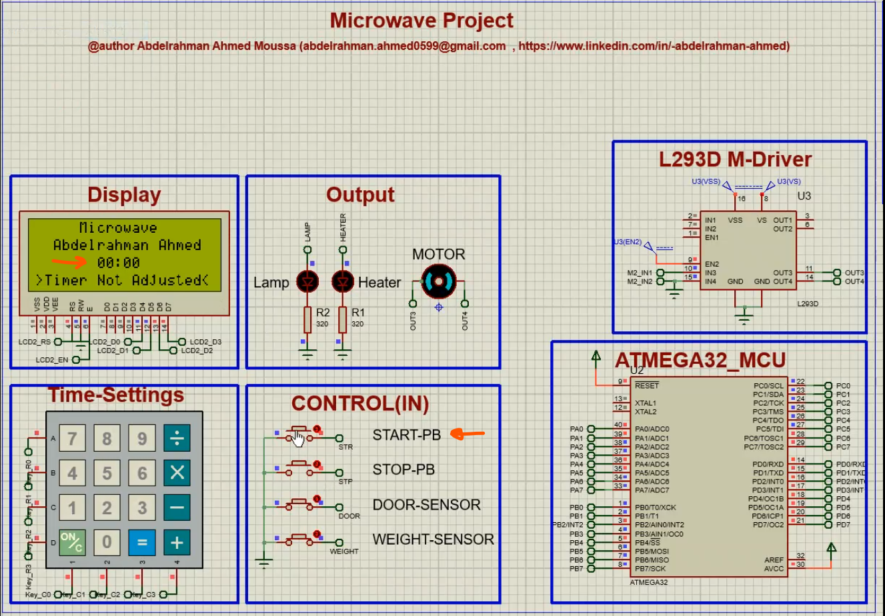
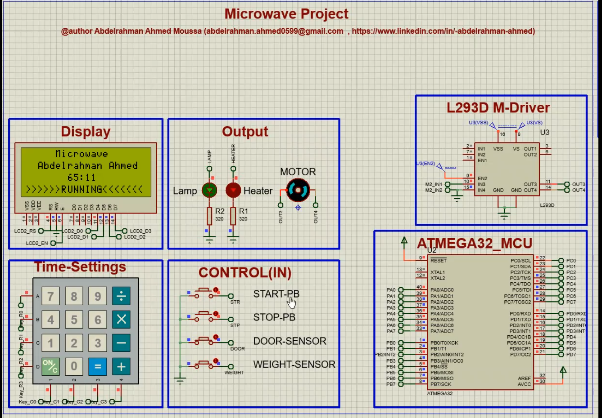

<h1 align="center">Microwave Oven</h1>


<p align="center">
  
</p>

---
## 🚀 Introduction

### Overview

The **Microwave Oven Control System** is a microcontroller-based application designed to manage the operations of a microwave oven. This system includes a state machine that responds to user inputs, sensor readings, and system components. Whether you're building a new microwave oven or enhancing an existing one, this project provides a solid foundation for implementing the control logic.

> **Note:** This project can be fully tested, run, and developed using Proteus simulation software. **There is no need for physical hardware setup to get started**. **Proteus** provides a virtual testing environment that allows for the complete simulation of the microwave oven control system, including all electronic components and microcontroller interactions.

> The project is **open source** and you can use it for your own projects.

### Key Features

1. **State Machine Management**:
   - The heart of the system is a robust state machine that governs the microwave's behavior.
   - Transitions between states occur based on user actions (start,stop) and sensor events (door open/close, food exist/not_exist, timer adjused/not).

2. **User Interface Interaction**:
   - The system interacts with users through a keypad.
   - Users can set the cooking timer, start/stop the microwave, and receive prompts on the display.

3. **Display Updates**:
   - The display provides status information.
   - It shows the current state ("Door Opened", "Running", "Paused",e.g.) and prompts users as needed.

4. **System Control Components**:
   - The system manages various components:
     - **Heater**: Responsible for cooking the food.
     - **Motor**: Controls the turntable.
     - **Lamp**: Illuminates the microwave cavity.
   - Activation and deactivation of these components are handled by the state machine.

---
 
## 📑 Table of Contents

- [🚀 Introduction](#-introduction)
- [📑 Table of Contents](#table-of-contents)
- [⚙ Working](#-working)
    - [System Behavior](#system-behavior)
- [🗂  Project Hierarchy](#project-hierarchy)
    - [Directories](#directories)
    - [Files](#files)
- [🛠️ Development Tools Required](#️-development-tools-required)
- [⏬ Installation](#-Installation)
    - [Code](#code)
    - [Simulation](#simulation)
- [⏭ What is next?](#-what-is-next)
- [🙋‍♂️ Contribute](#️-contribute)
- [📞 Contact me](#-contact-me)

---

## ⚙ Working

### System Behavior

This microwave oven control system primarily involves these main user operations:

> **Simulation Video:** This is a simulation [video](03-Docs/simulation/microwave_record.mp4) using proteus that shows all system operations.

1. **Setting the Timer**:
    - Use the keypad to input the desired cooking time.
    - The display will guide you through this process.
     - Setting timer from **keypad**:
       
            
     - Reseting timer by pressing **Stop_PB**:

       
            
2. **Starting the Microwave**:
   - Close the microwave **door**,so you don't see this message.

     
   - Put **food** inside the microwave,so you don't see this message.
   
        
   -  Adjust the timer **(min:sec)** from **keypad**,so you don't see this message.

      
   -  If all above conditions are **true** ,the system transitions to the **"Running" state**.The heater and motor activate, and the display updates accordingly.

      
     
3. **Pausing the Microwave**:
   - If the **Stop_PB** is pressed,the system transitions to the **"Paused" state**.

     
   - If the **door opened**.
       - This message will apear. 

         
       - Then system transitions to the **"Paused" state**.

         
   - If the **no food inside**.
       - This message will apear. 

         
       - Then system transitions to the **"Paused" state**.

         
        
4. **Starting after Pausing**:
   - If the **Start_PB** is pressed,the system transitions to the **"Running" state** again.

     
    
   - But the **door** must be closed and the **food** must be inside,so you don't see 
     these messages and the system **remaining in pause state**.

     
    
5. **Stop the Microwave**:
   - Press the **Stop_PB** once the system transitions to **Pause state** and once 
     again the **Timer resets** then the system transitions to the **wellcome page**.

     
     
---

## 🗂 Project Hierarchy

The project contains some files and directories:

### Directories

* **[Microchip-Studio-Project](01-Microchip-Studio-Project/)**: Contains the code implemented using Microchip Studio IDE.
* **[code](02-code/)**: Contains only the layred architecture code files.
* **[docs](03-Docs/)**: Contains the documentation files and simulation pictures/videos.
* **[simulation](04-simulation/)**: Contains the simulation files (Proteus 8.7).

### Files

* **[README.md](README.md)**: The description of the project (What you are reading now).
* **[tools.md](tools.md)**: Contains **How to setup** the tools required to run this project.

---

## 🛠️ Development Tools Required

Read this [guide]() to know what tools are required to develop this project.

---
## ⏬ Installation

### Clone

   Clone this repository to your local machine:
   ```
   git clone https://github.com/abd-elarhman/Microwave-Oven.git
   ```
### Code

**To develop the project, you need to:**

* YOU MUST HAVE **Microchip studio** installed on your computer.
* Open the **(01-Microchip-Studio-Project\Atmega32)** directory.
* Open the **[Microwave.atsln]** file and it will open with Microchip Studio.
* You can build the project by clicking on **F7** key on keyboard.

**NOTE**: The code is documented as much as possible. Hope you will understand the code.

### Simulation

**To simulate the project, you need to:**

* YOU MUST HAVE **Proteus** installed on your computer.
* Open the (04-simulation/) directory.
* Open [Microwave_simulation.pdsprj] file and it will open with Proteus.
* The simulation works as the following:
    * load the ".hex" or ".elf" file on the microcontroller in the simulation and run.
    * load "Atmega32.hex" file when you build the project from microchip studio with **Release** solution configurations.
         ```
         ..\01-Microchip Studio Project\Atmega32\Atmega32\Release
         ```
    *  load "Atmega32.elf" file when you build the project from microchip studio with **Debug** solution configurations and **Enjoy debugging features of proteus**.
         ```
         ..\01-Microchip Studio Project\Atmega32\Atmega32\Debug
         ```

---

## ⏭ What is next?

The Microwave Oven Control System is an ongoing project, and I'm constantly looking to improve and expand its capabilities. Here are some of the enhancements I'm considering for future releases:

- **User Profiles**: Allowing users to create profiles to save their preferred settings and quickly access frequently used cooking modes.
- **Advanced Features**: Implementing additional features such as automatic **Sleep** when it not used.
- **Recipe Database**: Incorporating a database of recipes with pre-programmed cooking settings for user convenience.
- **Real Time OS**: implementing the system using **RTOS**.

Your feedback and contributions are valuable to me. If you have ideas for new features or ways to enhance the system, please feel free to share them by opening an <a href="https://github.com/abd-elarhman/Microwave-Oven/issues">issue</a></strong> or submitting a <a href="https://github.com/abd-elarhman/Microwave-Oven/pulls">pull request</a></strong>.

Stay tuned for updates and thank you for your support!

---

## 🙋‍♂️ Contribute

Contributions to this project are welcome! Follow these steps:

1. Fork the repository.
2. Create a feature branch (e.g., `feature/AmazingFeature`).
3. Commit your changes (`git commit -m 'Add some AmazingFeature'`).
4. Push to the branch (`git push origin feature/AmazingFeature`).
5. Open a pull request.

---

## 📞 Contact me

<p><a href="https://www.linkedin.com/in/-abdelrahman-ahmed/" target="_blank"></a> <a href="mailto:http://abdelrahman.ahmed0599@gmail.com/" target="_blank"></a> </p>
